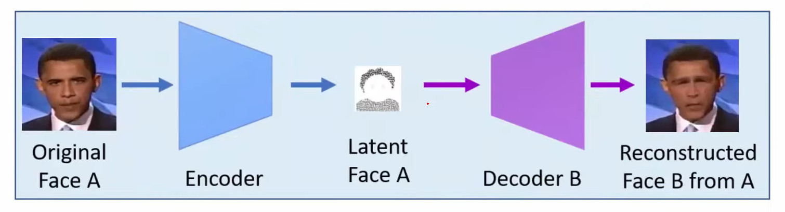

Facial Manipulations

DeepFake에 대해 알아보기 전에 얼굴을 조작하는 기술들(Facial Manipulations)에 대해 알아보겠습니다.

- Face Synthesis 
  - Face Synthesis는 존재하지 않은 얼굴을 생성하는 기술로 아래 이미지와 같이 실제로는 존재하지 않은 얼굴을 생성하는 기술입니다.
  - 대표적으로 (GAN) StyleGAN을 사용 할 수 있습니다.

- Facial Attributes 
  - Facial Attributes은 기존 얼굴에서 특정한 속성만 변경하여 새로운 모습을 만들어내는 기술입니다.
  - 예를 들어 아래 이미지와 같이 안경을 쓰고 있지 않은 사람을 안경 쓴 얼굴로 변경 할 수 있습니다. 
  - 대표적으로 StarGAN를 사용합니다.

- Facial Expression 
  
  - Facial Expression은 input 인물의 표정, 입모양 등을 바꾸는 기술입니다. 
    
  - Source - 피해자 
  
  - Target  - 표정
  
  - 대표적으로 Synthesizing Obama 가 있습니다.
  
    
  
- Face Swap 
  
  -  서로 다른 사람의 얼굴을 바꾸는 기술로 흔히 알려져있는 Deepfake가 Face Swap에 속합니다.
  
  - Source - 얼굴 제외
  
  - Target - 피해자
  
    

## Deepfake

Deepfake란 인공지능 기술(Deep learning)을 활용해 기존에 있던 인물의 얼굴이나, 특정한 부위를 합성한 것을 의미합니다. Deepfake는 머리의 이미지를 통채로 합성하는 것이 아니라 얼굴만(안면윤곽, 눈, 코, 입) 변경하는 특징을 갖고 있습니다. 

#### Deepfake의 원리

Deepfake는 Autoencoder를 기반으로 구성되기 때문에 Autoencoder에대해 먼저 알아보겠습니다.      

Autoencoder는 인코더(Encode)와 디코더(Decoder)로 구성됩니다.  Autoencoder 아래와 같은 과정을 반복하며 Input Data의 Feature를 추출할 수 있습니다.

1. Input Data x를 인코더에 넣어 압축된 값 z를 얻습니다. 
2. 압축된 값 z를 디코더에 통과시켜 Output x'를 얻어냅니다.
3. 출력된 x'와 x가 동일하게 (input data를 복원하도록) 학습시킵니다.  

다시 Deepfake로 돌아와서 Deepfake의 순서를 살펴보겠습니다. 

1. 학습을 위해 이미지에서 사람의 얼굴 부분을 추출합니다.  alignments file , mask과 같은 파일을 추가적으로 추출 할 수 있습니다. 이 때 동영상을 기준으로 한다면 동영상에서 미리 프레임 단위로 쪼개 이미지를 저장해야합니다.
2. 1번 과정에서 준비한 얼굴 이미지로 Autoencoder 학습을 진행합니다. 여기서 Deepfake의 핵심 아이디어는 Autoencoder에서 Source와 Target 둘 모두  같은Encoder를 사용하도록 하고, Decoder 부분은 서로 다른 Decoder를 사용하여 학습을 진행합니다. 이를 통해 Encoder는 서로 공유되기 때문에 두 인물 사이에 공통적인 feature(눈, 코, 입의 위치 등...)를 추출하도록 학습하게 됩니다. 반면 Decoder 부분은 서로 다른 Decoder를 사용하기 때문에 Identity features(눈의 모양, 피부색 등..)를 추출하도록 학습하게 됩니다.
3. 마지막으로 Converting 입니다.  이 과정은 Decoder 파트를 2번 과정에서 학습한 B로 변경하여 B가 가지고 있는 특징만 추출하도록 하여 B의 얼굴로 변경하게  됩니다. 

[Toy Model - Github](https://github.com/hanqingguo/deepfake-pytorch)

1. 동영상을 프레임단위로 이미지 캡처 (Source 와 Target 각각의 동영상 crop_from_video.py 실행)
2. 캡처한 이미지에서 얼굴만 추출하여 이미지로 저장 (캡처한 Source 와 Target 각각의 이미지에대해 crop_face.py 실행)
3. AutoEncoder 학습 (train.py)
4. Source의 영상을 입력으로 넣고, Target의 Decoder를 사용하여  Converting (convert_video.py 실행)

### Deepfake 문제점

아래와 같은 범죄들에 악용될 수 있기 때문에 DeepFake인지 구별하는 기술도 많이 연구되고 있음

* 딥페이크를 이용한 포르노

* Fake News(가짜 뉴스)
* 스미싱 범죄
* 등 ....