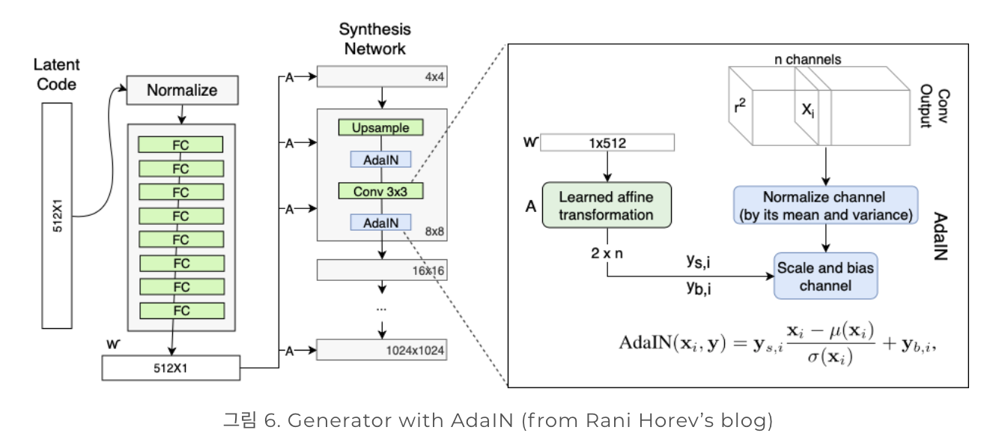
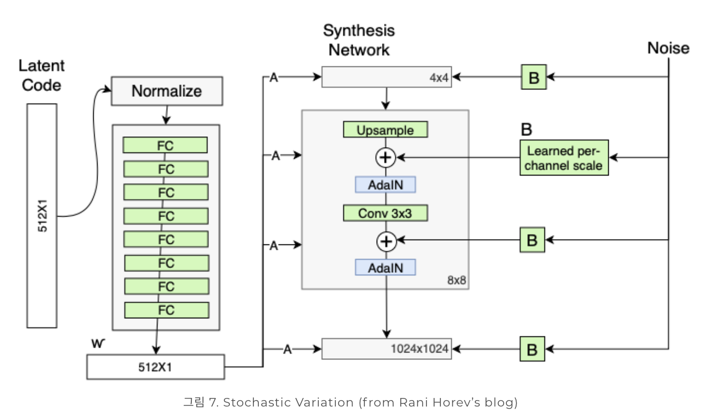
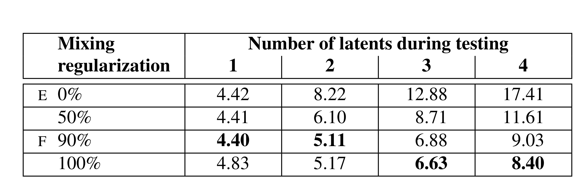
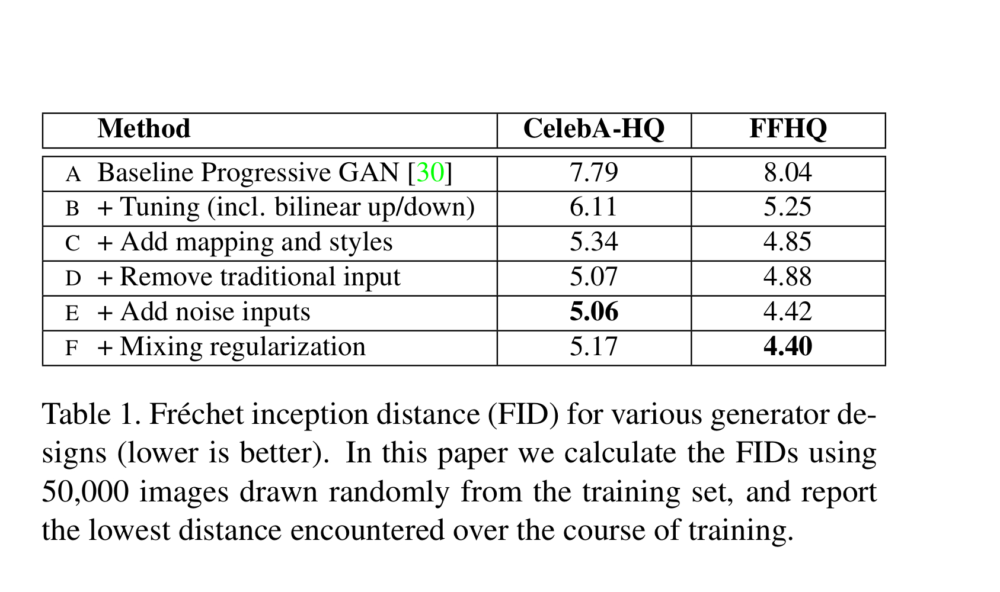
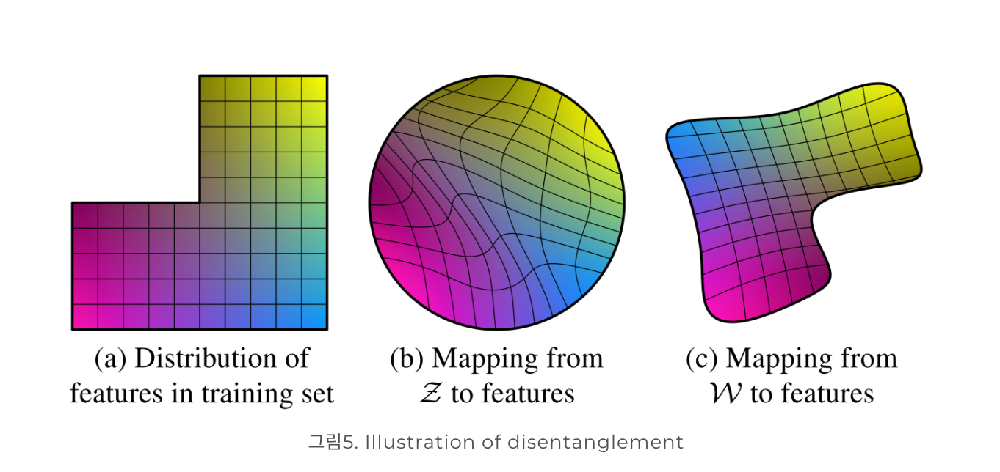

## Style GAN

#### A Style-Based Generator Architecture for Generative Adversarial Networks

##### Network

* intermediate latent vector 
    **기본 genterator**
    생성된 latent vector를 바로 GAN generator에 사용하게되면, train dataset에 entangle하게됨.
    **style gan**
    반면 latent vector를 8개의 FC layer에 통과시킨 intermediate latent vector를 사용하므로써, 
    train dataset에 disentangle함.

* style vector
    본 논문에서는 intermediate vector를 affine transform 통해 style vector를 만듬
    style vector라 이름이 붙여진 이유는 이부분이 generator의 style을 담당하기 때문

* AdaIN
    해당 style vector는 AdaIN을 통해 systhesis data에 입혀진다.
    여기서, 각 covolution layer마다 style vector가 입혀진다.

    Synthesis network의 매 layer마다 AdaIN을 통해 style을 normalize 한 후 새로운 style을 입히게 되므로, 특정 layer에서 입혀진 style은 바로 다음 convolutional layer에만 영향을 끼친다. 따라서 각 layer의 style이 특정한 visual attribute만 담당하는 것이 용이해진다.
    
* Noise
    
    노이즈는 해당 레이어의 사이즈만큼 uncorrelated Gaussian noise에서 생성이된다.
    노이즈를 추가하는 이유는 머리카락과 같은 디테일한 부분을 stochastic적으로 추가하기위함이다.

* truncation trick

##### Feature
* Style Mixing
    2 개의 latent vector W를 이용한다.
    2개의 latent vector를 랜덤하게 style tensor로 사용한다.
    스타일이 서로 correlated하는 것을 방지한다.
  **result**
    
* Stochastic variation
    per-pixel noise를 통해 localized한 부분을 변형할 수 있다.

* Separation of global effects from stochasticity
    style tensor는 global한 부분을 encode하는 역할을 함.
    stochastic variation은 specific한 부분을 역할을 함.
    

##### Experiments
* Dataset
    CelebA-HQ
    Flickr-Faces-HQ (FFHQ)

* Metric
    FID (Frechet inception distance score)
* Result
    

##### Disentangle

우리는 latent space에서의 선형적인 이동이 1 factor를 변화시키는 방향으로 이동시키길 원한다.

##### New Metric
* Perceptual path length
    latent vector의 약간의 변화가 얼마나 급격하게 변하는지를 확인
    latent vector Z와 latent vector Z+epsilon 으로 generate 했을때 VGG에 embedding해서 특정 feature map의 거리로 구함
    
* Linear Separability

    
    